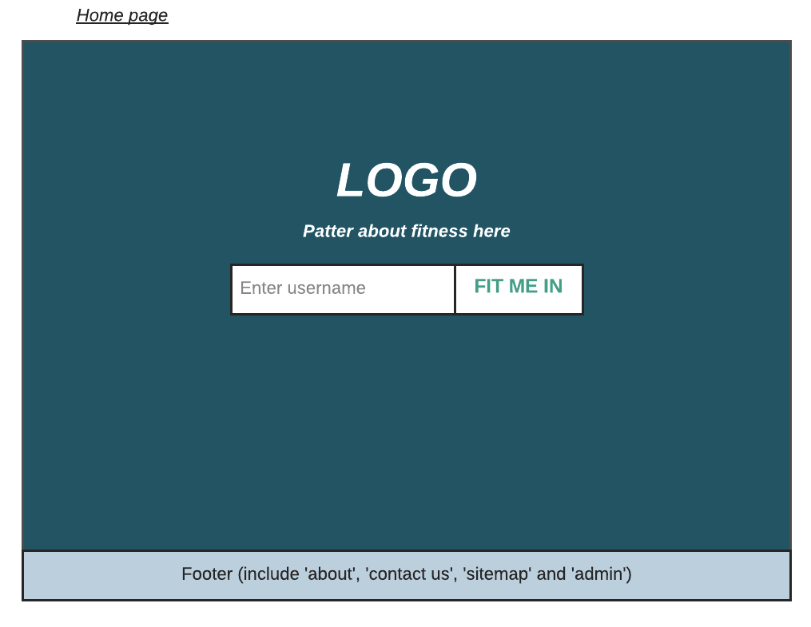
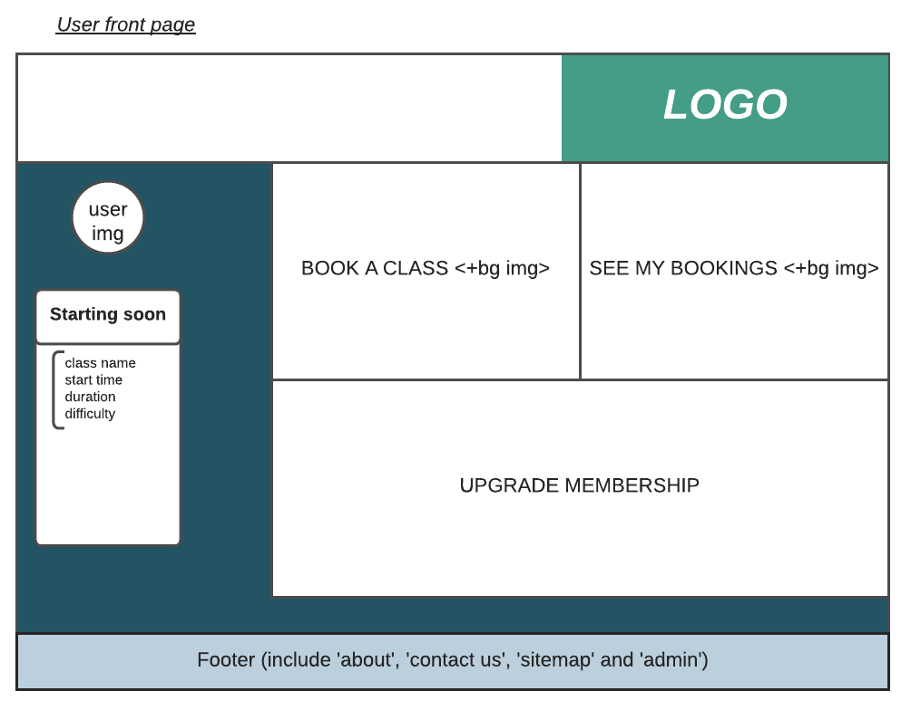
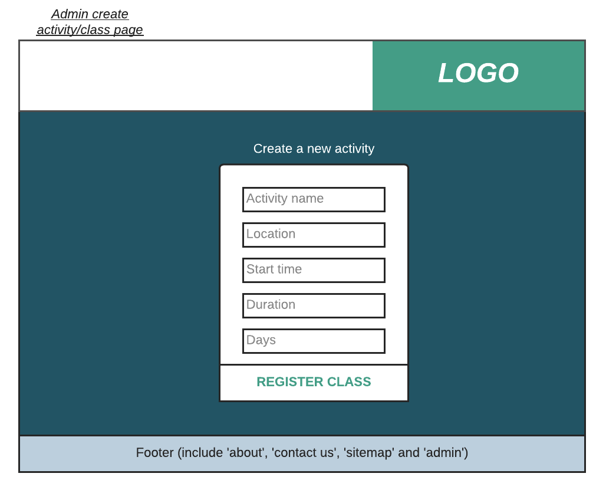

# FitMeIn

A Python Flask app for gym members to manage class bookings at their local gym.

### Project Brief

"A local gym has asked you to build a piece of software to help them to manage memberships, and register members for classes."

FitMeIn allows users to view and book onto upcoming classes, view expired bookings, and book new classes as required.

An Admin route is included for gym staff to view, edit or add classes to the upcoming schedule.

#### MVP

- The app allows users to create a membership profile for their gym
- The app allows the gym to create and edit classes
- The app allows members to book specific classes 
- The app displays a list of all upcoming classes for both gym members and admin staff
- The app displays all members booked in for a particular class

### Wireframes:
 - Main login screen

- User homepage

- Create class form

#### Inspired By
[Glofox](https://www.glofox.com/club-solution/), [Pike13](https://www.pike13.com/pike13-scheduling-software-demo)

Created as part of the CodeClan PSD course.

#### Upcoming features

- Classes have a maximum capacity, and users can only be added while there is space remaining.
- Premium and Standard memberships. Standard members can only be signed up for classes during off-peak hours.

